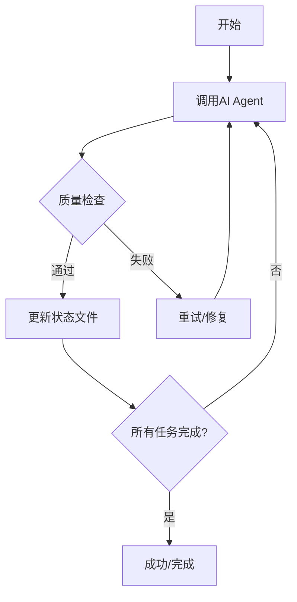

# Introducing Ralph: PhSpec工作流中的自主AI代理循环

## 背景：从PhSpec到Ralph

在我们之前的文章中，我们介绍了PhSpec——一个基于开源OpenSpec内化的工具，它通过结构化的方式管理项目变更。PhSpec提供了一个清晰的变更流程，从需求分析到设计评审，再到实施应用，每个阶段都有明确的规范和文档支持。

然而，在PhSpec的apply阶段，我们发现了一个新的痛点：

**当变更进入"apply"阶段后，开发者需要手动为每个变更调用agent执行编码任务。**这不仅重复劳动，而且容易遗漏变更。更重要的是，AI agent在执行复杂任务时，经常会遇到上下文限制、需要多次迭代的问题。

这就是我们引入**Ralph模式**的原因。

## 什么是Ralph模式？

Ralph是一个**自主AI代理循环（Autonomous AI Agent Loop）**的概念，由[Geoffrey Huntley](https://ghuntley.com/ralph/)提出。它的核心理念是：

> **运行AI编码工具（如Amp或Claude Code）反复执行，直到所有PRD项目完成。每次迭代都是一个新的实例，具有干净的上下文。内存通过git历史、progress.txt和prd.json持久化。**

### Ralph的关键特性

#### 1. 每次迭代 = 全新上下文

Ralph的每个迭代都会启动一个**新的AI实例**，具有干净的上下文。迭代之间的唯一内存来源是：

- **Git历史**：来自之前迭代的提交
- **progress.txt**：学习记录和上下文
- **prd.json**：哪些任务已完成

这种设计解决了AI agent长期运行时上下文污染和记忆丢失的问题。

#### 2. 小任务原则

每个PRD项目都应该足够小，可以在一个上下文窗口中完成。如果任务太大，LLM会在完成前耗尽上下文，产生低质量的代码。

**合适大小的任务示例：**
- 添加数据库列和迁移
- 向现有页面添加UI组件
- 用新逻辑更新服务器操作
- 向列表添加筛选下拉框

**太大的任务（需要拆分）：**
- "构建整个仪表板"
- "添加身份验证"
- "重构API"

#### 3. 反馈循环至关重要

Ralph只有在有反馈循环的情况下才能工作：

- **类型检查**捕获类型错误
- **测试**验证行为
- **CI必须保持绿色**（损坏的代码会在迭代中累积）

#### 4. AGENTS.md更新是关键

每次迭代后，Ralph会用学习内容更新相关的`AGENTS.md`文件。这很重要，因为AI编码工具会自动读取这些文件，未来的迭代（以及未来的人类开发者）可以从发现的模式、陷阱和约定中受益。

## Ralph在PhSpec工作流中的应用

`phspec-auto-apply`是Ralph模式在PhSpec工作流中的一个具体实现。它将PhSpec的结构化变更管理与Ralph的自主循环能力相结合，带来以下新能力：

### 1. 智能变更发现与队列管理

Ralph会自动扫描项目中的`phspec/changes`目录，识别所有已进入apply阶段的变更（通过检测`tasks.md`文件）。

- 自动发现待应用变更，无需手动跟踪
- 支持按优先级或自定义规则排序
- 智能过滤，跳过已完成的变更

### 2. 自主执行循环

对于每个待应用变更，Ralph执行自主循环：



### 3. 持久化内存管理

Ralph通过以下方式维护跨迭代的记忆：

- **运行状态文件**：`.phspec-auto-apply/runs/<runId>.json` 记录每个变更的状态
- **详细日志**：`.phspec-auto-apply/logs/<runId>/<change>.log` 记录完整执行过程

### 4. PhSpec SDD工作流的优势

`phspec-auto-apply`基于PhSpec的SDD（Specification-Driven Development）工作流工作，这带来一个重要的优势：

**无需过度担心上下文丢失**

在原生Ralph模式中，每次迭代都是全新的上下文，因此需要通过Git历史、progress.txt等方式在迭代间传递信息。而在PhSpec工作流中：

- **完整的变更上下文**：每个PhSpec变更都包含完整的规格说明文档（spec.md、tasks.md等）
- **结构化信息传递**：变更的需求、设计、任务都已经结构化记录
- **独立执行单元**：每个变更都是一个独立的执行单元，agent可以从变更文档中获取所有必要信息

因此，当agent调用超限或其他异常需要重试时，即使启动了新的agent实例（全新的上下文），agent也可以直接从PhSpec变更文档中读取所有需要的信息，重新开始执行。这种设计使得重试机制非常可靠，而无需依赖复杂的跨迭代记忆传递。

### 5. 智能并发控制

Ralph支持并发执行多个变更应用任务：

```bash
# 并发执行3个变更
phspec-auto-apply run --concurrency 3
```

并发策略：
- 对于相互独立的变更，可以并行处理，大幅提高效率
- 对于需要顺序处理的变更，可以将并发数设置为1
- 根据项目实际情况灵活调整

### 5. 强大的容错与重试机制

- **自动重试**：支持配置重试次数，失败的任务会自动重试
- **指数退避**：采用指数退避策略，避免对系统造成过大压力
- **超时控制**：每个任务都有超时限制，防止任务卡死
- **断点续传**：任务中断后可以从上次中断的地方继续

### 6. 实时流式输出

Ralph提供了丰富的实时输出，让开发者随时了解执行进度：

- **四档日志级别**：quiet、normal、verbose、debug
- **流式输出**：实时显示agent的执行过程
- **工具调用跟踪**：显示每个工具的调用和结果
- **进度指示**：清晰显示当前处理进度和剩余任务

## 工具详细功能介绍

### 核心命令

`phspec-auto-apply`提供了三个主要命令：

#### 1. `phspec-auto-apply list` - 列出待应用变更

```bash
phspec-auto-apply list
```

输出示例：
```
PhSpec Auto Apply - List Changes

Project root: /path/to/project
Changes directory resolved: /path/to/project/phspec/changes

Scanned 5 changes
Found 3 changes, 2 ready to apply

Apply-ready changes (2):
  - expert-auth-free-apply-integration
  - user-dashboard-optimization

Not-ready changes (3):
  - api-refactor-v2: 缺少 tasks.md，尚未进入 apply 阶段
  - payment-gateway-update: 缺少 tasks.md，尚未进入 apply 阶段

Total:
  Total: 5, Ready: 2, Not-ready: 3
```

#### 2. `phspec-auto-apply run` - 执行Ralph循环

```bash
phspec-auto-apply run
```

输出示例：
```
PhSpec Auto Apply - Run

Project root: /path/to/project
Changes directory: /path/to/project/phspec/changes
Found 5 changes, 2 ready to apply
New run ID: 20260330-143522
Agent command: devagent --yolo
Concurrency: 1
Timeout: 1200000ms
Log level: normal

Starting execution queue...

══════════════════════════════════════════════════════════════════════════
  Agent Execution: expert-auth-free-apply-integration (attempt 1/99)
══════════════════════════════════════════════════════════════════════════

  🤖 Assistant:
     I'll help you apply change for "expert-auth-free-apply-integration".
     Let me first explore current state of PhSpec change and understand what
     needs to be implemented.

  🔧 list_directory
     ✓ Completed (23ms)

  🔧 glob
     ✓ Completed (12ms)

  🤖 Assistant:
     This is a PhSpec change with no errors - Backward Compatibility preserved.
     The feature is ready for testing in development environment.

  ✓ Completed in 597.29s

══════════════════════════════════════════════════════════════════════════

Execution Summary
Run Info:
  runId: 20260330-143522
  changesDir: /path/to/project/phspec/changes

Statistics:
  Total: 5, Ready: 2, Skipped: 3, Success: 2, Failed: 0

✓ All changes applied successfully!
```

#### 3. `phspec-auto-apply report <runId>` - 查看运行报告

```bash
phspec-auto-apply report 20260330-143522
```

### 高级选项

```bash
phspec-auto-apply run \
  --changes-dir phspec/changes \    # 变更目录
  --agent-cmd "devagent --yolo" \  # 自定义agent命令
  --retry 2 \                      # 失败重试次数
  --concurrency 3 \                # 并发数
  --timeout-ms 1800000 \          # 超时时间（毫秒）
  --log-level verbose               # 日志级别
```

#### 断点续传

```bash
phspec-auto-apply run --resume 20260330-143522
```

### 输出文件结构

```
.phspec-auto-apply/
├── runs/
│   └── 20260330-143522.json    # 运行状态文件（prd.json的等价物）
└── logs/
    └── 20260330-143522/
        ├── expert-auth-free-apply-integration.log
        └── ...
```

## 使用场景与最佳实践

### 场景1：PhSpec的标准工作流集成

```bash
# 1. 完成PhSpec的design阶段
# 2. 生成tasks.md进入apply阶段

# 3. 使用Ralph自动应用
phspec-auto-apply list      # 查看待应用变更
phspec-auto-apply run       # 启动Ralph循环

# 4. 查看执行报告
phspec-auto-apply report <runId>
```

### 场景2：处理多个独立变更

当有多个独立的变更待应用时：

```bash
# 使用高并发加速处理
phspec-auto-apply run --concurrency 5
```

### 场景3：调试与故障排查

```bash
# 使用调试模式查看详细执行过程
phspec-auto-apply run --log-level debug

# 查看某个变更的详细日志
cat .phspec-auto-apply/logs/20260330-143522/change-id.log

# 查看运行状态
cat .phspec-auto-apply/runs/20260330-143522.json | jq
```

### 场景4：CI/CD集成

在CI/CD流程中，使用安静模式和试运行：

```bash
# CI环境中使用安静模式
phspec-auto-apply run --log-level quiet

# PR检查中只扫描不执行
phspec-auto-apply run --dry-run
```

## 安装与配置

### 安装

```bash
# 局部安装（推荐）
npm install
npx phspec-auto-apply <command>

# 全局安装
npm install -g
phspec-auto-apply <command>
```

### 构建

```bash
npm run build
```

### 开发模式

```bash
npm run dev
```

## 架构设计

`phspec-auto-apply`采用模块化设计，体现了Ralph模式的核心原则：

### 核心模块

1. **Discovery（发现模块）**
   - 扫描变更目录
   - 检测变更状态
   - 识别apply-ready变更

2. **Orchestrator（编排模块）**
   - 管理任务队列
   - 控制并发执行
   - 实现重试和容错逻辑

3. **Agent（Agent模块）**
   - 构建agent提示词
   - 运行agent进程
   - 处理流式输出

4. **Reporting（报告模块）**
   - 管理日志输出
   - 保存运行状态
   - 生成执行报告

### Ralph模式的体现

| Ralph原则 | phspec-auto-apply实现 |
|-----------|---------------------|
| 每次迭代全新上下文 | 每个变更调用新的agent实例 |
| Git历史作为记忆 | N/A |
| prd.json持久化 | 运行状态文件记录完成状态 |
| 进度文件 | 详细日志记录执行过程 |
| 反馈循环 | 支持质量检查和重试机制 |

## 与原生Ralph的对比

| 特性 | 原生Ralph | phspec-auto-apply |
|------|------------|-------------------|
| 任务来源 | prd.json | PhSpec changes |
| 工作流 | PRD → 开发 | PhSpec → Design → Apply |
| 变更管理 | 手动创建分支 | 基于PhSpec变更ID |
| 内存持久化 | prd.json, progress.txt | 运行状态文件, 日志 |
| 支持的AI工具 | Amp, Claude Code | 任意CLI工具 |
| 并发支持 | 单任务 | 支持多任务并发 |
| 适用场景 | 从零开始开发 | 在现有项目中应用变更 |

## 未来规划

### 1. 深度Ralph模式集成

- **AGENTS.md自动更新**：每次迭代后自动更新AGENTS.md文件
- **学习记录**：将agent的学习内容自动追加到progress.txt
- **智能任务拆分**：自动将大任务拆分为小任务

### 2. 增强的反馈循环

- **自定义质量检查**：支持配置自定义的质量检查命令
- **测试集成**：自动运行测试套件并处理失败
- **CI集成**：与CI/CD平台深度集成

### 3. 脱离PhSpec的独立使用场景

`phspec-auto-apply`可以演变成一个更通用的Ralph实现：

#### 场景A：通用任务自动化

```bash
ralph run \
  --task-file tasks.json \
  --progress-file progress.txt \
  --agent-command "claude --yolo" \
  --max-iterations 10
```

#### 场景B：多阶段工作流

```bash
ralph run \
  --workflow design,implement,test \
  --stages-config workflow.json
```

#### 场景C：跨项目管理

```bash
ralph run \
  --projects proj1,proj2,proj3 \
  --shared-progress shared-progress.txt
```

### 4. 用户体验提升

- **Web UI**：提供可视化的管理界面
- **进度条**：更直观的进度展示
- **交互模式**：支持交互式选择和确认

### 5. 智能化改进

- **依赖分析**：自动识别变更之间的依赖关系
- **影响分析**：评估变更对系统的影响范围
- **风险预测**：基于历史数据预测变更风险

## 核心概念回顾

### 1. 小任务是成功的关键

按照Ralph模式，每个变更中的任务都应该足够小，可以在一个上下文窗口中完成。如果任务太大，考虑：

- 拆分为多个子任务
- 使用渐进式实现
- 增加迭代次数限制

### 2. 反馈循环不可或缺

确保有以下反馈循环：

- 类型检查（TypeScript、Flow等）
- 单元测试
- 集成测试
- 代码质量检查（ESLint、Prettier等）

### 3. 持久化记忆的价值

利用好持久化记忆：

- 状态文件：跟踪任务完成状态
- 日志文件：用于调试和学习

### 4. Agent配置的重要性

为你的项目优化agent配置：

- 在`CLAUDE.md`或`prompt.md`中添加项目特定信息
- 包含代码库约定和最佳实践
- 添加常见的陷阱和注意事项

## 总结

`phspec-auto-apply`将Ralph的自主AI代理循环模式引入到PhSpec工作流中，让代码变更的应用过程实现完全自动化。它结合了PhSpec的结构化变更管理和Ralph的强大迭代能力，为团队提供了一个高效、可靠的自动化解决方案。

无论是配合PhSpec使用，还是作为通用的Ralph实现独立使用，`phspec-auto-apply`都能为团队带来显著的效率提升和更好的代码质量。

## 资源链接

- **原始Ralph模式**：[Geoffrey Huntley's Ralph](https://ghuntley.com/ralph/)
- **GitHub仓库**：[snarktank/ralph](https://github.com/snarktank/ralph)
- **相关文章**：[PhSpec工具介绍](./phspec-introduction.md)
- **文档目录**：`/docs`

## 参考资源

- [Amp文档](https://ampcode.com/manual)
- [Claude Code文档](https://docs.anthropic.com/en/docs/claude-code)
- [Ryan Carson的Ralph使用文章](https://x.com/ryancarson/status/2008548371712135632)

---

*持续改进，持续交付。* ✨
